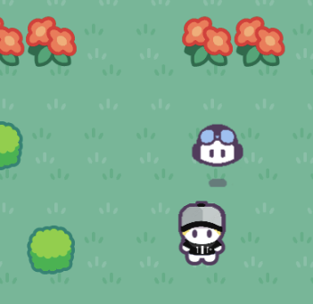

# Cozy Copilot

## Welcome to the Land of Code! 👋

The Land of Code is a bright, exciting place full of creativity and possibilities. It's where people build amazing things - games, apps, and programs that connect the world around us. This magical land is home to the Codelets, hardworking and cheerful little creatures who keep everything running smoothly. Codelets are responsible for maintaining the systems, organizing data, and ensuring that all the programs in the Land of Code work perfectly.

But lately, things have been a little off... Mischievous [Bugs](./docs/Bugs.md) have started causing trouble, making systems crash and projects glitch. These Bugs are actually mutated Codelets, transformed by a strange force, and they need your help to return to their normal state. That’s where you come in! With big dreams and ideas, plus a certain knack for solving problems, you'll set out on an adventure with your loyal [Companions](./docs/Companions.md) to explore the Land of Code, battle (or as we say, *fix*) the bugs, and make everything run smoothly again.

Along the way, you'll meet new friends, discover hidden treasures, and unlock your full potential as a developer.

Ready to get started?

**Let's go Copilot!** 🚀

## Run the game

| Command | Description |
|---------|-------------|
| `npm install` | Install project dependencies |
| `npm run dev` | Launch a development web server |

# References

- Graphics based on this link [this vector RPG demo](https://rhosgfx.itch.io/vector-rpg-overworld-demo)
